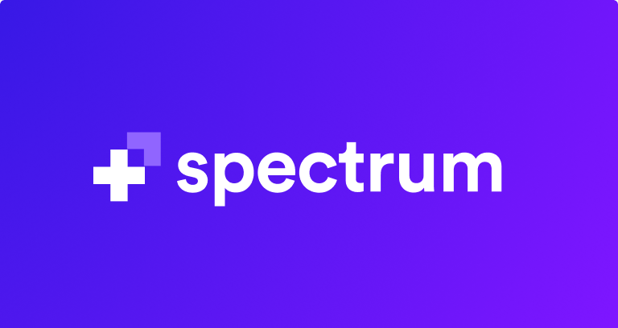

<div align="center">

  [](https://spectrum.chat)

  ### Simple, powerful online communities.
  
</div>

----

This is the main monorepo codebase of [Spectrum](https://spectrum.chat). Every single line of code that's not packaged into a library is in this repository.

*[Click here for more information about Spectrum](https://spectrum.chat)*

## Contributing 

**We heartily welcome any and all contributions that match our product roadmap and engineering standards!**

That being said, this codebase isn't your typical open source project because it's not a library or package with a limited scope—it's our entire product.

### Ground Rules

#### Report a bug or discuss a feature idea

If you found a technical bug on Spectrum or have ideas for features we should implement this issue tracker is the best place to put them. Make sure to follow the issue template and you should be golden! ([click here to open a new issue](https://github.com/withspectrum/spectrum/issues/new))

#### Fix a bug or implement a new feature

If you find a bug on Spectrum and open a PR that fixes it we'll likely merge it given it matches our engineering standards. If you want implement a new feature, open an issue first to discuss what it'd look like and to ensure it fits in our roadmap and plans for the app. (we'll likely close a PR implementing a feature that wasn't explicitly whitelisted as something we want)

Want to fix a bug or implement an agreed-upon feature? Great, jump to the [local setup instructions](#local-setup)!

### Codebase setup

With the ground rules out of the way, let's talk about the coarse architecture of this mono repo:

- **Full-stack JavaScript**: We use Node.js to power our servers, and React to power our frontend and mobile apps. Almost all of the code you'll touch in this codebase will be JavaScript.
- **Background Jobs**: We leverage background jobs (powered by [`bull`](https://github.com/OptimalBits/bull) and Redis) a lot. These jobs are handled by a handful of small worker servers, each with its own purpose.
- **GraphQL**: Our API is powered by GraphQL, which defines a large part of what our frontend and mobile apps look like.

#### Technologies 

Here is a list of all the big technology decisions we've made to built Spectrum with:

- RethinkDB: Data storage
- Redis: Caching
- PassportJS: Authentication
- Apollo: Everything GraphQL from front to back
- React: Frontend
- React Native: Mobile apps
- DraftJS: WYSIWYG writing experience on the web

#### Folder structure

```sh
spectrum/
├── athena     # Worker server (notifications and general processing)
├── chronos    # Worker server (cron jobs)
├── docs
├── email-templates
├── hermes     # Worker server (email sending)
├── hyperion   # Server rendering server
├── iris       # API server
├── mercury    # Worker server (reputation)
├── mobile     # Mobile apps
├── pluto      # Worker server (payments; syncing with Stripe)
├── public     # Public files used on the frontend
├── shared     # Shared JavaScript code
├── src        # Frontend SPA
└── vulcan     # Worker server (search indexing; syncing with Algolia)
```

##### Naming Scheme

As you can see we follow a loose naming scheme based on ancient Greek, Roman, and philosophical figures that are somewhat related to what our servers do:

- Iris (/ˈaɪrᵻs/) is one of the goddesses of the sea and the sky and was the messenger of the gods during the Titanomachy. (the battle between the titans and the gods)
- Hyperion: (/haɪˈpɪəriən/) is one of the twelve Titan children of Gaia and Uranus.
- Athena (/əˈθiːnə/) is the goddess of wisdom, craft, and war.
- Hermes (/ˈhɜːrmiːz/) is the messenger god, moving between the worlds of the mortal and the divine.
- Chronos (/ˈkroʊnɒs/) is the personification of Time in pre-Socratic philosophy
- Mercury (/ˈmɜːrkjʊri/) is the patron god of financial gain, commerce, eloquence (and thus poetry), messages/communication (including divination), travelers, boundaries, luck, trickery and thieves
